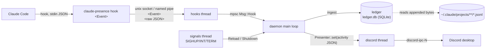

# Architecture

See also: [ipc-and-security.md](ipc-and-security.md), [ledger.md](ledger.md),
[configuration.md](configuration.md), [README](../README.md).

## Components

| Component | Source | Role |
|---|---|---|
| Hook process | `src/main.rs` (`hook`) | Started by Claude Code per event. Reads stdin, prepends `<Event>\n`, sends it to the daemon, exits 0. No config, no JSON parsing, no output. |
| Daemon | `src/daemon.rs` | Main thread event loop: sessions, expiry, rotation, rendering, saving. Entry points: `claude-presence daemon` and `claude-presenced` (`src/bin/claude-presenced.rs`; GUI subsystem on Windows, logs to `daemon.log` in the data dir). |
| Hook listener | `src/ipc.rs` | Thread `hooks`. Accepts connections, reads one message each (max 16 MiB, 2 s read timeout on Unix), forwards to the main loop. |
| Discord worker | `src/discord.rs` | Thread `discord`. Owns the Discord IPC connection, rate limiting, reconnect backoff, keepalive. |
| Ledger | `src/ledger.rs` | Incremental transcript parsing, lifetime stats, delta saves to the SQLite database `ledger.db` (opened only for each load or save). See [ledger.md](ledger.md). |
| Git reader | `src/git.rs` | Branch and GitHub origin read from `.git` files; no `git` process. Cached per cwd for 60 s (`GIT_TTL`), cache cleared past 64 entries. |
| Presence rendering | `src/presence.rs`, `Daemon::render` | Template substitution, field clamping (128 bytes, 300 for image keys, 32 for button labels), activity JSON. |
| Config | `src/config.rs` | `config.toml` schema and defaults. Loaded at start and on reload; never by the hook process. |

## Data flow

1. Claude Code runs `"<exe>" hook <Event>` (wired by `install`, timeout 5 s) and pipes the event JSON on stdin.
2. The hook process sends `<Event>\n<raw JSON>` to the socket or pipe. Errors are ignored.
3. The `hooks` thread reads the message and calls `route`: normal events become `Msg::Hook`; `__shutdown` becomes `Msg::Shutdown`; other `__` events are dropped (debug log `ignoring control event`).
4. The main loop parses the JSON (`sonic-rs`), updates the session, ingests the transcript, then `tick()` renders and calls `Presenter::set` only if the rendered activity changed.
5. The Discord worker sends `SET_ACTIVITY` subject to the rate limit.

## Threads and timers

| Thread | Stack | Exists | Blocks on |
|---|---|---|---|
| main | default | always | `mpsc::recv_timeout(wait)` |
| `hooks` | 128 KiB | always | `accept()` |
| `discord` | 256 KiB | always (respawned if `client_id` changes on reload) | condvar, with a timed wait only when something is due |
| `signals` | 64 KiB | Unix only; blocks SIGINT/SIGTERM/SIGHUP in all threads and `sigwait`s | `sigwait` |
| scan workers | default | transient, during each scan: one scoped thread below 32 transcripts, otherwise up to 8 (limited by available parallelism) | n/a |

On Windows there is no signals thread: a console control handler sends `Shutdown` and sleeps 1.5 s so the loop can clear the card and save.

Nothing polls. `Daemon::tick` returns how long the loop may sleep: the minimum of the following, floored at 50 ms, defaulting to 24 h.

| Deadline | Applies when | Interval |
|---|---|---|
| Rotation | the displayed status has `rotation` frames | `rotation_interval` |
| Session expiry | any session can expire (`idle_timeout` not 0) | `last_activity + timeout + 1 s` |
| Transcript tail (`TAIL_EVERY`) | the displayed session is Thinking, Working or Compacting | 5 s |
| Save (`SAVE_EVERY`) | ledger has unsaved changes | 60 s |
| Rescan | `rescan_interval` is not 0 | `rescan_interval` (default 1800 s) |

The Discord worker has its own deadlines: the next allowed send (rate limit), the reconnect retry, and a keepalive resend while a card is shown (60 s; 20 s against an arRPC bridge).

There is no polling loop: the daemon wakes only for these timers (and for hooks and signals), so CPU use is near zero. Concretely:

- every `rotation_interval` (default 15 s) while the shown card has rotation frames (by default only Idle does);
- every 5 s to tail the transcript while the shown session is Thinking, Working or Compacting;
- every 60 s while the ledger has a pending save;
- once per `rescan_interval` (default 30 min) for the background rescan;
- at a session's expiry time;
- in the Discord worker, for the keepalive resend while a card is shown;
- a 24 h fallback wake when nothing is pending.

With no sessions, a clean ledger and `rescan_interval = 0`, only the 24 h fallback wake remains.

Discord limits (`src/discord.rs`): at most 4 `SET_ACTIVITY` per 20 s window (`MAX_PER_WINDOW`, `WINDOW`) and at least 4 s apart (`MIN_GAP`); bursts coalesce to the latest wanted activity. Reconnect backoff starts at 2 s and doubles to 60 s; a refused handshake (bad `client_id`) waits 300 s.

## Session state machine

Sessions are keyed by `session_id` (`"default"` if absent). A session is created by any event except `SessionEnd`.

| Event | Resulting status | Other effects |
|---|---|---|
| `SessionStart` (source `compact`) | Thinking | keeps counters; records model hint |
| `SessionStart` (source `resume`) | Idle | keeps `started`, prompts and tools (same conversation); clears tool and file; records model hint |
| `SessionStart` (other: `startup`, `clear`) | Idle | resets `started`, prompts, tools, tool, file; records model hint |
| `UserPromptSubmit` | Thinking | prompts +1, clears tool and file |
| `PreToolUse` | Working | tools +1, tool name (`mcp__a__b` shown as `a:b`), file from `file_path`, `notebook_path` or `path` |
| `PostToolUse`, `PostToolUseFailure` | Working | |
| `Notification` | Notification ("Waiting for input") | |
| `PreCompact` | Compacting | |
| `Stop` | Idle | clears tool and file |
| `SessionEnd` | session removed | final ingest of its transcript |
| anything else (e.g. `SubagentStop`) | unchanged | liveness only; `SubagentStop` also ingests `<transcript dir>/<session id>/subagents/*.jsonl` |

Every event refreshes `last_activity`, `cwd` and `transcript_path`, then ingests the transcript.

The card's `{prompts}` is the transcript's own count once the transcript is known, else the hook count. The transcript's count covers the whole conversation, including history that `--resume` copied into a new transcript (see [ledger.md](ledger.md#counting-rules)). While a turn runs (Thinking or Working) and the hook count is ahead of it, one is added for the prompt just submitted and not yet written. Never more than one: `UserPromptSubmit` also fires for custom slash commands, which the transcript does not count as prompts, so the hook count can drift ahead for good.

### Expiry

A session with no hooks for `idle_timeout` seconds is a candidate. Sessions in an active status (Thinking, Working, Compacting) use `max(idle_timeout, 3600)`. It is dropped only if its transcript file has also been quiet that long; a recently modified transcript counts as activity (a future mtime counts as now). `idle_timeout = 0` disables expiry. Log line: `session <id> expired`.

### Which session is shown (sticky choice)

Tier 2: Thinking, Working, Compacting, Notification. Tier 1: Idle. `pick` chooses the highest tier, then the most recent `last_activity`. The currently displayed session is kept while its tier is at least the best tier, so parallel active sessions do not flap. When it drops to Idle while another session is still tier 2, the card switches.

### Rotation

The base frame comes first, then `rotation` frames whose variables are all non-empty and non-zero. The frame index advances every `rotation_interval` seconds; it resets when the displayed session or its status changes. With no sessions the card is cleared.

## Shutdown

`SIGINT`, `SIGTERM`, `__shutdown` (sent by `install`/`uninstall`) or Windows console close: log `shutting down`, save the ledger, clear the card (the worker is given 1 s; on Windows a worker still stuck in Discord pipe I/O then has it cancelled with `CancelSynchronousIo`, for up to about 500 ms more), exit 0.
